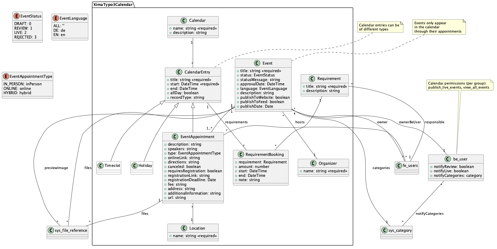

<div align="center">


# TYPO3 Calendar

**Standalone calendar and event management for TYPO3, built on dedicated record types**

</div>

[](https://typo3.org/)
[](https://www.php.net/)
[](https://www.gnu.org/licenses/gpl-2.0)
[](https://github.com/xima-media/xima-typo3-calendar/actions/workflows/tests.yml)
[](https://codecov.io/gh/xima-media/xima-typo3-calendar)

---

Calendar and event management for TYPO3: editor-facing backend modules, a frontend event
listing and detail view, a status-based publishing workflow with e-mail notifications,
dashboard widgets, and an optional requirements-management layer — all on dedicated record
types rather than on top of another calendar package.

The extension owns the data model and the backend workflows. Exposing events to a frontend
application is left to the consuming project — see
[Building your own frontend API](Documentation/CalendarFeed.md#building-your-own-frontend-api).

## Contents

- [Requirements](#requirements) · [Installation](#installation) · [Features](#features)
- [Record Types](#record-types) · [Backend Modules](#backend-modules) · [Frontend Plugins](#frontend-plugins)
- [Configuration](#configuration) · [Access Control](#access-control) · [Notifications](#notifications) · [Dashboard Widgets](#dashboard-widgets)
- Guides: [Access Control](Documentation/AccessControl.md) · [Notifications](Documentation/Notifications.md) · [Calendar Feed](Documentation/CalendarFeed.md) · [Extending](Documentation/Extending.md) · [DataHandler Events](Documentation/DataHandlerEvents.md) · [Contributing](CONTRIBUTING.md)

## Requirements

| Package | Purpose |
|---------|---------|
| PHP >= 8.2, TYPO3 >= 13.4 | — |
| `typo3/cms-dashboard` | Dashboard widgets |
| `xima/xima-typo3-recordlist` | Events backend module |

## Installation

```bash
composer require xima/xima-typo3-calendar
```

Then, per site:

1. Add the **XIMA TYPO3 Calendar** site set (`xima/xima-typo3-calendar`) to your site's
  `dependencies` so the route enhancers and TypoScript load.
2. Set the **Event detail page** site setting (`xima_typo3_calendar.eventShowPid`) to the page
  holding the *Event Detail* plugin.
3. Store calendar records in a sysfolder and set that folder's **page module** to *Events*.
4. Optionally adjust the [extension configuration](#extension-configuration).

## Features

- **Structured event model** — events, their appointments (dates/occurrences), organizers,
  locations, and optional requirements as first-class record types; speakers are captured as
  free text on each appointment.
- **Backend modules** — a record-list module for the calendar records and an interactive
  calendar overview.
- **Frontend plugins** — event list and combined event/appointment detail view, with clean
  URLs via site-set route enhancers.
- **Publishing workflow** — draft → review → live/rejected status flow with e-mail
  notifications to reviewers and owners.
- **Access control** — per-group permissions gate publishing and cross-editor visibility;
  enforced query restrictions scope visibility in frontend *and* backend.
- **Dashboard widgets** — ready-to-publish events, upcoming appointments, canceled
  appointments, and soon-needed requirements.
- **Requirements management** (optional) — track resources an appointment needs (beamer,
  speaker desk) and their bookings.
- **PSR-14 change events** — typed events on create/update/delete of calendar records.

## Record Types

| Record Type         | Description                                                   | Table                                                  |
|---------------------|---------------------------------------------------------------|--------------------------------------------------------|
| Calendar            | Calendar container for entries                                | `tx_ximatypo3calendar_domain_model_calendar`           |
| Event               | Event with appointments, categories, and registration options | `tx_ximatypo3calendar_domain_model_event`              |
| Event Appointment   | One dated occurrence: date/time, location, appointment type   | `tx_ximatypo3calendar_domain_model_entry`              |
| Organizer           | Event organizer                                               | `tx_ximatypo3calendar_domain_model_organizer`          |
| Location            | Event location                                                | `tx_ximatypo3calendar_domain_model_location`           |
| Requirement         | Requirement for an appointment (speaker desk, beamer)         | `tx_ximatypo3calendar_domain_model_requirement`        |
| Requirement Booking | Booking of a requirement for a given appointment              | `tx_ximatypo3calendar_domain_model_requirementbooking` |

An **Event** has a status (`DRAFT`, `REVIEW`, `LIVE`, `REJECTED`), an owning frontend user, and
a backend owner (`owner_be_user`, set automatically on creation). Registration fields
(`requires_registration`, `registration_link`, `registration_deadline`, `fee`) live on the
event. An **Event Appointment** is one dated occurrence; its type is `inPerson`, `online`, or
`hybrid`, and its speakers are stored as free text. Requirements are only relevant with the
[requirements feature](#requirements-management) enabled.



## Backend Modules

The extension registers a **Calendar** module group with two modules:

- **Events** — a record list (built on `xima/xima-typo3-recordlist`) of the calendar record
  types: calendar, event, appointment, organizer, location, and — with the
  requirements feature enabled — requirement. Records are collected from all pages whose page
  module is set to `events`, including one level of subpages. Requirement bookings are edited
  inline on the appointment.
- **Calendar** — an interactive month/week/list overview of all appointments, backed by the
  AJAX route `ajax_xima_calendar_events`. Clicking an entry opens its event edit form.

## Frontend Plugins

| Plugin       | Controller action       | Purpose                                               |
|--------------|-------------------------|-------------------------------------------------------|
| Event List   | `EventController::list` | Lists events.                                         |
| Event Detail | `EventController::show` | Renders a single event **or** one appointment of it.   |

The detail plugin accepts either an `event` or an `appointment` argument — given only an
appointment, its parent event is resolved automatically. The site set's route enhancer
produces four URL shapes:

```
/{event_uid}-{event_slug}                      → event
/{event_uid}-{event_slug}/a{appointment_uid}   → appointment of that event
/{event_uid}/a{appointment_uid}                → slug-less fallback
/a{appointment_uid}                            → appointment only
```

`event_slug` is a cosmetic static segment — there is no slug field and no mapping aspect for
it, so any value resolves. It is declared `static` *and* given a requirement, because TYPO3
discards a `static` flag for a variable that has none; without both, `event_slug` stays a
dynamic argument and every generated URL carries a `cHash`.

## Configuration

### Site settings

| Setting                            | Type | Description                                                         |
|------------------------------------|------|---------------------------------------------------------------------|
| `xima_typo3_calendar.eventShowPid` | page | Page displaying the single view of an event and its appointment.     |

Used for frontend link generation (calendar feed, API) and for the backend **preview** buttons
on event and appointment records.

### Extension configuration

| Key                                    | Type    | Description                                                                  |
|----------------------------------------|---------|------------------------------------------------------------------------------|
| `notifications.parentCategory`         | int     | Parent category whose children are offered as the notification filter.        |
| `restrictions.unrestrictedRecordTypes` | string  | Comma-separated `record_type` values exempt from the visibility restrictions. |
| `features.requirementsManagement`      | boolean | Enables the requirements-management layer (off by default).                   |

### Template overrides

TypoScript constants take an override path for each Fluid root:

```typoscript
plugin.tx_ximatypo3calendar {
    view.layoutRootPath = EXT:my_site/Resources/Private/Extensions/Calendar/Layouts/
    view.templateRootPath = EXT:my_site/Resources/Private/Extensions/Calendar/Templates/
    view.partialRootPath = EXT:my_site/Resources/Private/Extensions/Calendar/Partials/
    persistence.storagePid = 42
}
```

Notification e-mail templates and the recordlist status column are overridden differently — see
[Extending](Documentation/Extending.md).

### Requirements management

Off by default. Enabled through `features.requirementsManagement` in the extension
configuration, appointments can then declare the requirements they need, requirements can be
booked per appointment, and the *soon-needed requirements* dashboard widget appears.

## Access Control

Two permissions live in the **Calendar** custom permission group
(`tx_ximatypo3calendar_permissions`), granted per backend group under its *Access Lists*.
Administrators hold both implicitly.

| Permission                | Identifier            | Grants                                                  |
|---------------------------|-----------------------|---------------------------------------------------------|
| Publish events (set live) | `publish_live_events` | Setting an event **Live**, and editing live records.     |
| See all events            | `view_all_events`     | Seeing every draft/review/rejected event, not only own.  |

Visibility is enforced by two query restrictions appended to **every** query against the event
and entry tables, so the rules hold across Extbase and plain database queries — in the frontend
and in the backend.

Full rules, the record-type exemption, and the caveat that these restrictions survive
`removeAll()`: **[Documentation/AccessControl.md](Documentation/AccessControl.md)**.

## Notifications

Events move **Draft → Review → Live**, with **Rejected** as the alternative review outcome.
Transitions send e-mails from six templates: reviewers are notified on submission, owners on
publish/reject/draft/pull-back, and subscribers of live-edit notifications when a live event
changes. Backend users opt in under **User Settings → Notifications**, optionally restricted to
a category subtree.

Recipient resolution, suppression rules, and template overriding:
**[Documentation/Notifications.md](Documentation/Notifications.md)**.

## Dashboard Widgets

Four widgets in the *Calendar* widget group, each linking back into the Events module:

- **Ready to publish events** — events in review, awaiting a decision.
- **Upcoming appointments** — the next scheduled appointments.
- **Canceled appointments** — appointments marked canceled.
- **Soon needed requirements** — requirements due soon (requires the requirements feature).

Widget queries are mutable from other extensions via `BeforeWidgetItemsFetchedEvent` — see
[Extending](Documentation/Extending.md).

## Documentation

| Guide | Contents |
|-------|----------|
| [Access Control](Documentation/AccessControl.md) | Permissions, query restrictions, record-type exemptions |
| [Notifications](Documentation/Notifications.md) | Workflow transitions, recipients, templates |
| [Calendar Feed](Documentation/CalendarFeed.md) | The vkurko/calendar JSON feed; building your own frontend API |
| [Extending](Documentation/Extending.md) | PSR-14 events, extension points, template overrides |
| [DataHandler Events](Documentation/DataHandlerEvents.md) | Record change events in detail |
| [Contributing](CONTRIBUTING.md) | Local setup, tests, static analysis, asset build |
| [Changelog](CHANGELOG.md) | Notable changes, incl. breaking ones and upgrade notes |

## License

[GPL-2.0-or-later](LICENSE.md).
